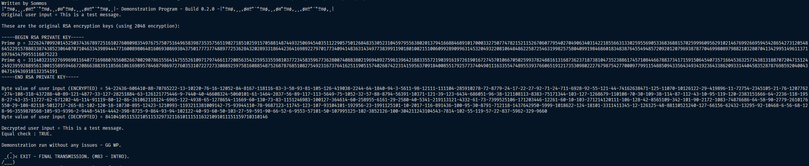

# Java RSA Encrypted Messenger 

    

Coursework for 2017/18. RSA encrypted messaging application using Java Swing for GUI.

This is for the programming coursework for the AQA exam board for the years of 2017/18.

This is an encrypted messaging application that uses the RSA encryption algorithm, this program is cryptographically secure provided the original prime numbers (p & q) that you start with are secure, and are not generated through any calcuable system.

# Contribution

If you'd like to contribute to `java_rsa_encrypted_messenger` please submit a pull-request on a
feature branch.

# Installing

Clone the repo:

    git clone http://github.com/Sommos/java_rsa_encrypted_messenger
    cd java_rsa_encrypted_messenger
